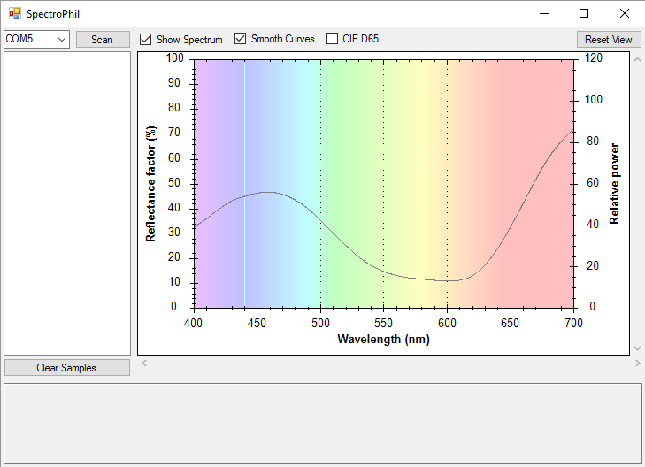
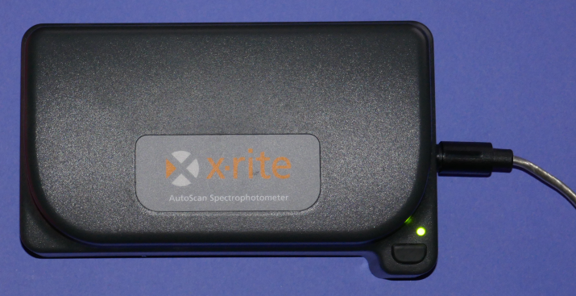

# SpectroPhil

Prototype application and libraries for spectrophotometry.

## About

SpectroPhil is a small prototype application for interfacing with
spectrophotometers via C#. I wrote it on a cold winter night in January 2013,
and it was intended to be the starting point for a reusable set of libraries for
colorimetry and spectrophotometry.

Unfortunately, I never found the time to develop it further. The existing code
is just a proof of concept, but perhaps it will be enough to get someone else
started with their own project in this interesting field. Use at your own risk!

## Contents

* *SpectroPhil.Colorimetry* - Defines interfaces and values for illuminants and
  tri-stimulus values
* *SpectroPhil.Spectrophotometers* - Interfaces for spectrophotometers
* *SpectroPhil.Spectrophotometers.Xrite* - Implements X-Rite spectrophotometers
* *SpectroPhil.FormsApp* - The .NET Windows Forms test application
* *ZedGraph* - Third-party library for chart drawing

The only spectrophotometer implemented so far is the classic X-Rite DTP41, which
communicates via a serial port. I have successfully tested it with a Dynex
Serial-to-USB adapter (Model# DX-UBDB9).

## Usage

1) Connect an X-Rite DTP41 spectrophotometer to your PC
2) Start the application
3) Select the COM port that the spectrophotometer is running on
4) Click the 'Scan' button to collect a spectral sample

## Support

No support is provided for this project. However, if you make useful changes or
additions that could be beneficial to others, I would appreciate a
[pull request](https://github.com/ue4plugins/LogiLed/pulls?q=is%3Aopen+is%3Apr).

## References

* [X-Rite Homepage](http://www.xrite.com/)
* [Configuration Commands for the DTP41](http://www.xrite.com/service-support/Configuration_Commands_for_the_DTP41)
* [ZedGraph Homepage](https://sourceforge.net/projects/zedgraph/)